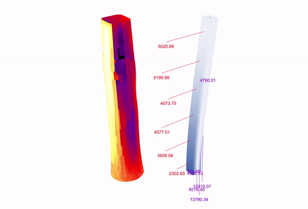
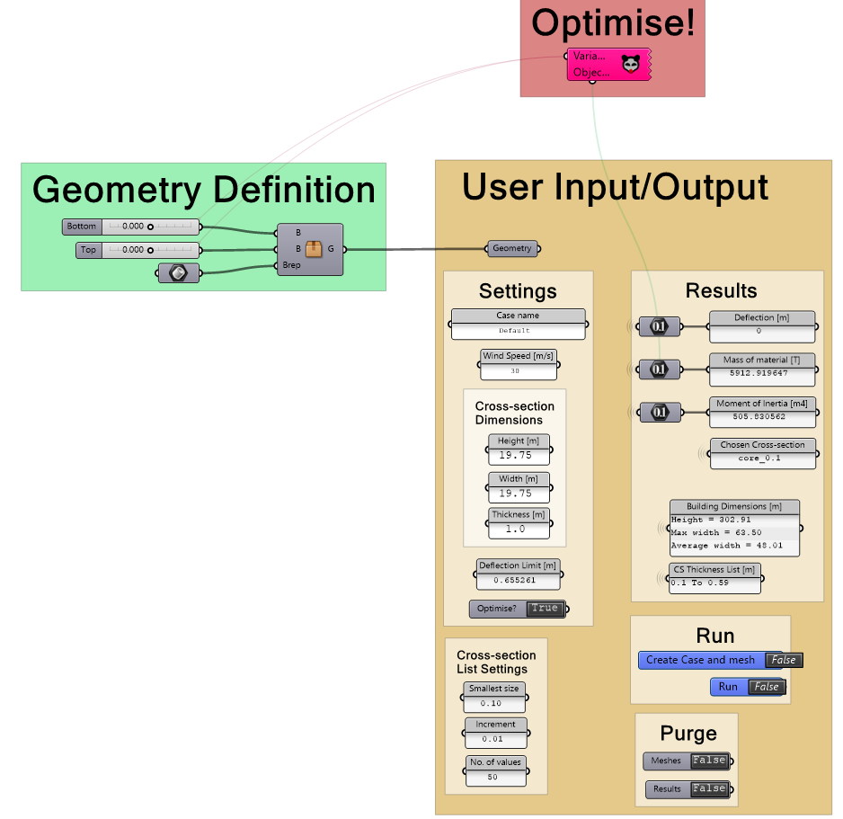

# FSIO
This is the Fluid-Structure Interaction based Optimisation (FSIO) script developed as part of my master thesis in the Building Technology programme at the TU Delft Faculty of Architecture and the Built Environment.

This script is a proof of concept of the method developed to optimise the external geometry of a complex shaped high-rise building based on static wind loading in an early design phase. It combines CFD and FEA in a partitioned FSI approach which is coupled with surrogate model based optimisation to manipulate a parametrically defined geometry to improve performance. The objective of the optimisation is to reduce the mass of material needed in the structural core of the building. The script is built for ease of use only requiring input in the 'User input/output' area of the script. More advanced users feel free to modify and improve the total script. It would be great to know what improvements you have made. Please reference the thesis if you use in your work.

The thesis report can be found here: https://repository.tudelft.nl/islandora/object/uuid:bea970ba-da91-40e5-b31d-53cf0cb15ec3?collection=education

Requirements:
- Rhinoceros 6
- Grasshopper 1.0
- Karamba3d 1.3.1
- Butterfly 0.0.05
- Opossum 1.7.1
- Ladybug tools 0.0.67

Instructions:
The script is setup so that one can use the tool by only interacting with 'User input/output' area at the beginning of the script.

1. Input your parametric geometry in the geometry container.
2. Give a case name and wind speed.
3. Input the dimensions of the core.
4. Toggle for 'Creat case and mesh' to create CFD mesh.
5. Toggle run to perform an initial FSI analysis.
6. Use deflection value from Results section as input for the 'Deflection limit' box and set 'Optimise?' toggle to true.
7. Fill in cross-section list for algorithm to choose from
8. Open Opossum, in settings tab set max iterations (60 - 120 recommended), you can select Maintain log file to have a list of options rather than single optimum, then Start optimisation.

Limitations:
- Only works on a single core building.
- Only concrete structural cores are used. No other structural systems.
- Limited to static wind loading using RNG k-E turbulence model.
- Only one wind direction used.

Contact:
erron_e@hotmail.com
